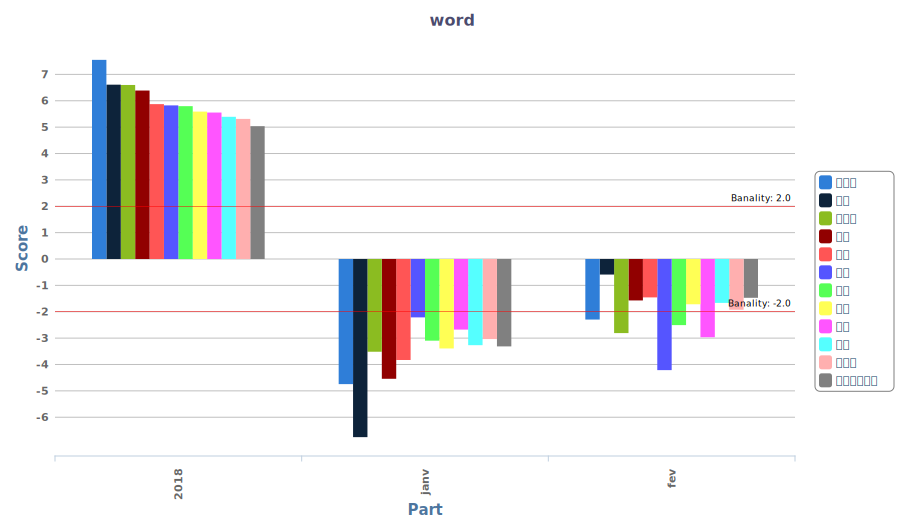
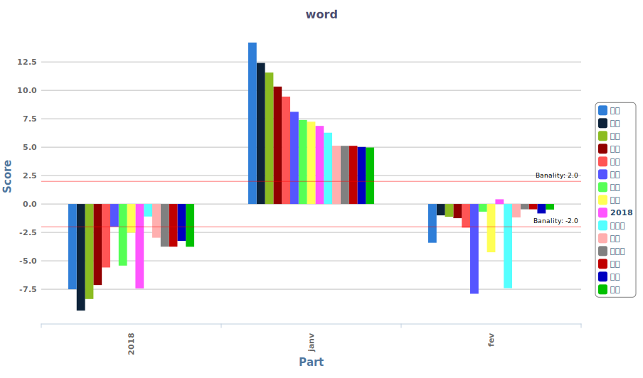
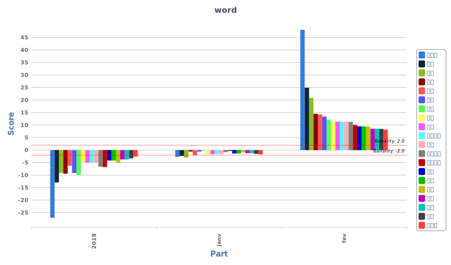
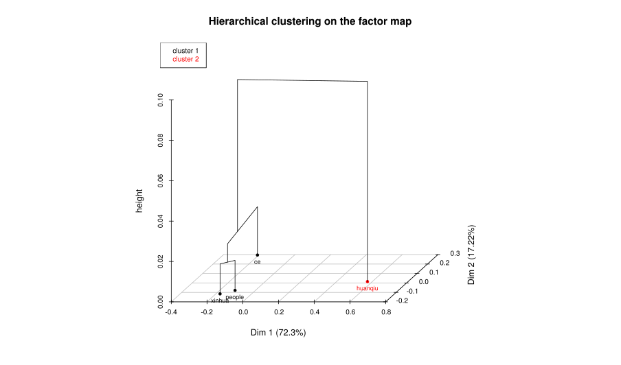
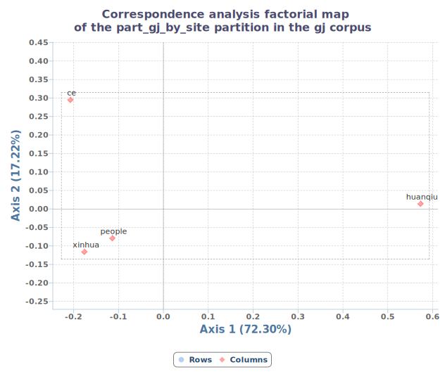

# "Gilets jaunes" dans la presse chinoise de Chine continentale

## 1. Info du groupe
### Membres : Chunyang JIANG et Yizhou XU
    
## 2. Données
### Sources (licence à préciser)
- People (presse quotidienne nationale) http://www.people.cn/
- Huanqiu (presse quotidienne nationale) http://www.huanqiu.com/
- Quotidien de la jeunesse de Chine (presse quotidienne nationale) http://www.cyol.com/
- Quotidien d'Economie (presse quoitidienne nationale) http://m.ce.cn/
- China Daily  (presse quoitidienne nationale)  http://world.chinadaily.com.cn/
- Nanfang (presse quotidienne régionale [Sud]) http://www.oeeee.com/ 
- The Paper (presse quoitidienne régionale [Shangaï]) https://www.thepaper.cn/
- Xinjingbao (presse quoitidienne régionale [Pékin]) www.bjnews.com.cn/
- Xinhua (agence) http://www.xinhuanet.com/- China News (agence) http://www.chinanews.com/
### Langue
Chinois de Chine continentale
### Période 
17 nov - 17 Fév
## 3. Recherche documentaire
## Références

---
MAJ : 01042019 
## Analyse exploratoire
### Piste 1
**partition : corpus_gilet_jaune et corpus_de_contraste**
#### spécificités (seuil : 5)
* PERS
    * Macron
    * gilet jaune
    * manifestants
    * Phillips
    * le Premier Ministre français
    * les Français
    * la police
    * les riches
    * personne inteviewée
    * de miliers de personnes
    * Castaner
    * Griveaux
    * Di Maio
    * toule le monde

* ORG
    * le gauche
    * l'extrême droite
    * La République
    * Assemblée nationale (de la Frace)
    * le Figaro
    * Parlement européen
    * côté français
    * côté italien
    * Cinq etoilles

* LIEU
    * France
    * la rue
    * Paris
    * Avenue des Champs-Elysées
    * l'Arc de Triomphe
    * partout
    * à travers tout le pays
    * Italie
    * province
    * ville
    * Yiwu

* ACTION
    * manifestation
    * émeute
    * saccage
    * pillage
    * augementer
    * baisser
    * annuler
    * rappel
    * eclater
    * concession
    * causer (NEG)
    * apparaître
    * débat
    * assembler
    * demande

* QUOI
    * réforme
    * taxe carburant
    * violence
    * euro
    * taxe
    * colère
    * magasin
    * prix des carburants
    * smic
    * sondage
    * classe
    * nationalisme
    * comportements violents
    * conflit
    * opinion publique
    * popularité
    * foulard
    * barrage routier
    * l'intégration

#### piste 2 (axe temporelle)
uniquement sur corpus_gilet_jaune, partition sur date : `2018 | janvier | fevrier` pour permettre d'observer l'evolution temporelle des termes

#### piste 3 (axe presse)
uniquement sur corpus_gilet_jaune, partition sur site de presse : `ce | xinhua | huanqiu | people`

